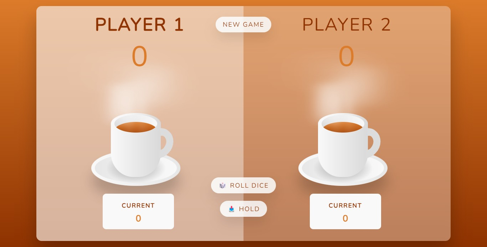
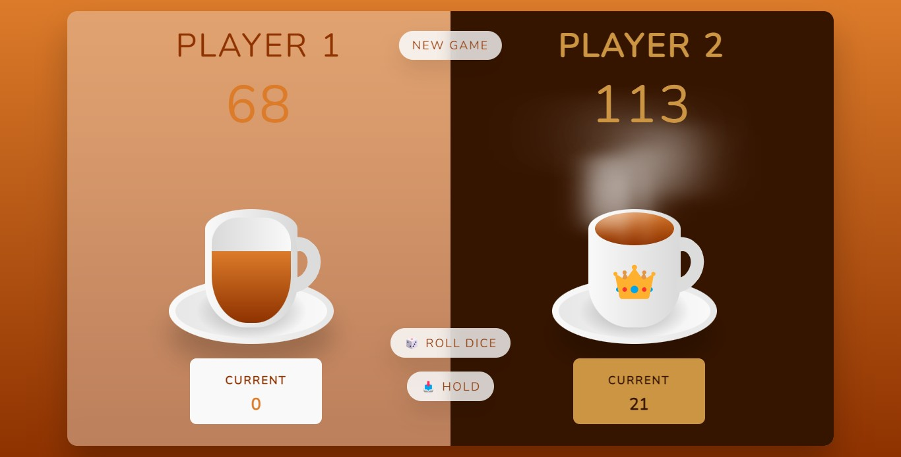

## ✨Project preview

<h1 align="center">☕ Pig Game</h1>

 

<h3 align="center">🙅 No Responsive.</h3>
<h3 align="center">
  Build Using:
  
  
  
</h3>

 

  
   
  

 
 

This is my version of a game based on Jonas Schmedtmann's "The Complete JavaScript Course", with a different design, His version can be found here: <a href="https://pig-game-v2.netlify.app/" target="_blank">https://pig-game-v2.netlify.app/</a>

The online site: <a href="https://lissbethe.github.io/Pig-Game/" target="_blank">☕ Pig Game</a>
